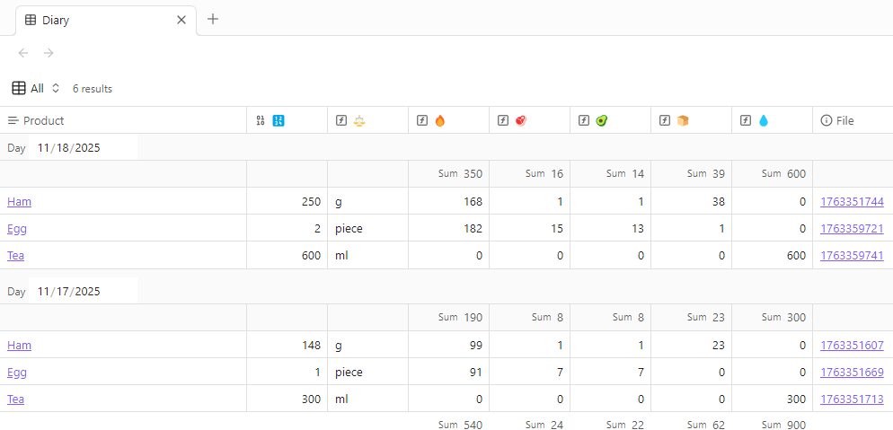

# Obsidian Foodiary (Bases) 🥪 🍎 🪵

[README in English](README.md)

Это пример хранилища [Obsidian](https://obsidian.md), которое автоматически считает КБЖУ для каждого приёма пищи и за день в целом.

Для автоматизации используется плагин Templater, а остальное сделано на чистом Obsidian Bases.



---

## 🚀 Как начать?

### 1. Установите Templater

Включите поддержку плагинов в хранилище и установите [Templater](https://github.com/SilentVoid13/Templater).

### 2. Настройте Templater

> [!tip]
> Пример уже содержит [файл настроек](vault/.obsidian/plugins/templater-obsidian/data.json) Templater, поэтому плагин, скорее всего, заработает без дополнительной настройки.

Установите следующие настройки:

- `Template folder location` — выберите папку `Templates`;
- `Trigger Templater on new file creation` — включите;
- `Folder templates` — настройте для двух папок:
    - `Products`: `Templates/Product.md`
    - `Records`: `Templates/Record.md`

### 3. Создайте карточки продуктов

Карточки продуктов — это отдельные заметки, в которых хранятся пищевая ценность продуктов. 

Свойства продукта (автоматически создаются Templater'ом при создании нового файла):

- `calories` — количество калорий;
- `protein` — содержание белков;
- `fat` — содержание жиров;
- `carbs` — содержание углеводов;
- `water` — содержание воды;
- `unit` — единица измерения (g, ml, piece);
- `unit_size` — размер единицы измерения, для которой указано КБЖУ и вода (например, 100 для граммов или 1 для штук).

Если продукт хранится в штуках, пищевую ценность удобно указывать на 1 штуку ([пример](vault/Products/Egg.md)). Если же продукт хранится в граммах ([пример](vault/Products/Ham.md)) — то на 100 грамм.

> [!tip]
> В [примере](vault) карточки продуктов находятся в папке [Products](vault/Products), но вообще они могут лежать где угодно.

### 4. Записывайте приёмы пищи

Каждый приём пищи — отдельная заметка в папке [Records](vault/Records). Их удобно создавать по кнопке `New` прямо из интерфейса [базы](vault/Diary.base).

Свойства заметки о приёме пищи (как и в случае с продуктом, для нового файла их создаёт Templater):

- day — дата приёма пищи (заполняется автоматически текущей датой);
- product — ссылка на карточку продукта;
- quantity — количество съеденного (в тех же единицах, что указаны в карточке продукта; например, 2 штуки или 150 граммов)
- timestamp — время / штамп (используется для сортировки, заполняется автоматически).

> [!tip]
> Я использую плагин [Meld Calc](https://github.com/meld-cp/obsidian-calc) для быстрого расчета веса съеденного (например, если нужно вычесть из веса блюда вес тары).

---

## 👀 Как смотреть?

В [Diary.base](vault/Diary.base) настроены три вида:

- **All** — все записи за всё время, сгруппированные по дням, с рассчитанным КБЖУ и воды за день.
- **Today** — только сегодняшние записи.
- **Yesterday** — записи за вчера.

---

## 🛠️ Как изменить?

Предположим, вы хотите учитывать клетчатку.

### 1. Добавить параметр в карточки продуктов

Соответствующий параметр нужно добавить в уже созданные карточки продуктов и в [шаблон](vault/Templates/Product.md) новой карточки:

```
---
calories:
protein:
fat:
carbs:
fiber:
water:
unit: g
unit_size: 100
aliases:
---
```

### 2. Добавить формулу

Текст формулы:

```js
(
    link(product).asFile().properties.fiber
    /
    link(product).asFile().properties.unit_size
    *
    quantity
).round()
```

### 3. Добавить колонку в вид

Добавьте в основной вид базы колонку по формуле, которую создали на предыдущем шаге.

Чтобы видеть сумму по новой колонке, кликните на её нижнюю часть и выберите функцию `Sum`.

> [!note]
> Это самодельная функция суммирования: стандартная, по всей видимости, неприменима к колонкам, значения которых вычисляются по формулам.

Собственно, это всё, осталось добавить эту колонку в другие виды базы и всё будет работать.
